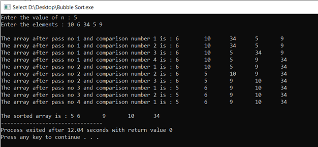
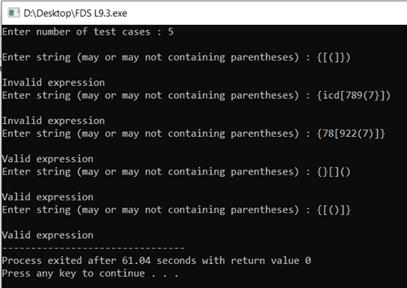

#Fundamentals of Data Structure

This repository consists some of my FDS (Fundamental of Data Structure) codes I did in my SEM 3.  It includes topics like **Sparse Matrix representation and operations, Queue and Stack Data Structures,  Stack applications, Searching and Sorting algorithms, Infix to postfix conversion.**  I have also attached some output screenshots here. 
A.	Sparse Matrix (Representation, Addition, Transpose)
  

  
B.Queue Data Structure 
    1.Dequeue (Double Ended Queue) 
C.Searching Techniques 
    1.Linear Search 
	2.Binary Search (Iterative and Recursive) 
D.Sorting Techniques (displayed passes and comparisons also) 
	1.Bubble Sort 
	2.Selection Sort 
	3.Insertion Sort 
	4.Merge Sort 
	5.Quick Sort 
  
E.Stack Applications 
	1.Stack using array implementation. 
	2.Well formedness of parenthesis. 
  
F.Infix to Postfix conversion  

