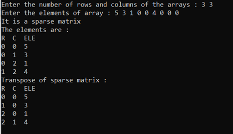

**Sparse Matrix representation and operations**

This repository contains of codes on **Sparse Matrix representation and operations** I did in SEM 3.  . 
A.	Sparse Matrix (Representation, Addition, Transpose)
   

  
